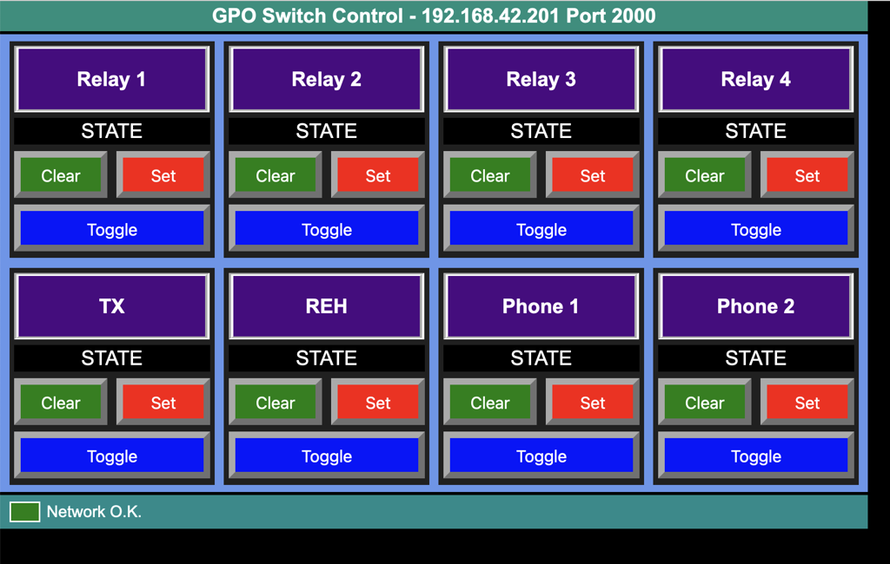

# HTML Control GET GPO - Basic Demo
The code in **GPO_Web_Control_Demo.html** is a simple web page controller for an http GET GPO interface. It allows the state of the switches to be seen and the states of the eight outputs to be set, cleared or toggled. The code is basic as this is just a simple demonstartion of principles.

## Required Files
The page requires two files  
| **File Name** | **Function** |
| ------ | --- |
| GPO_Web_Control_Demo.html | Primary CSS, Javascript and HTML |
| config.js | User property customising. Includes target IP address, port number, names of output controlled hardware. The config.js content is auto included into GPO_Web_Control_Demo.|

The files can be served by a standard web server, or used a a local file on the computer that will display the code.

## Customising config.js
The customisable elements are listed in the following table:

| **key name** | **comments**
|---|---|
| ipaddr | Enter the dotted IP address of the GPO interface to control |  
| port | Enter the port number that the GPO interface listens for traffic |
| switchurl | The page address relative to the root of the GPO server. The normal value for this field is "/gpiswitch/out" |
| net_timeout | The maximum amount of time in milliseconds to wait for a response after a status poll or switch command is sent. This value must be ess than the value used in field "poll_interval" |
| poll_interval | The interval in milliseconds between poll requests for the GPO status. The poll operates as an "Are you there" request as well as fetching the current state when the HTML page loads.|
| output_names | This is an array of nine strings. The first string is not used so should be left as a null string. The remaining strings are the names of the device controlled by each output. Null entries use a simple "Output n" as the control name. |  

