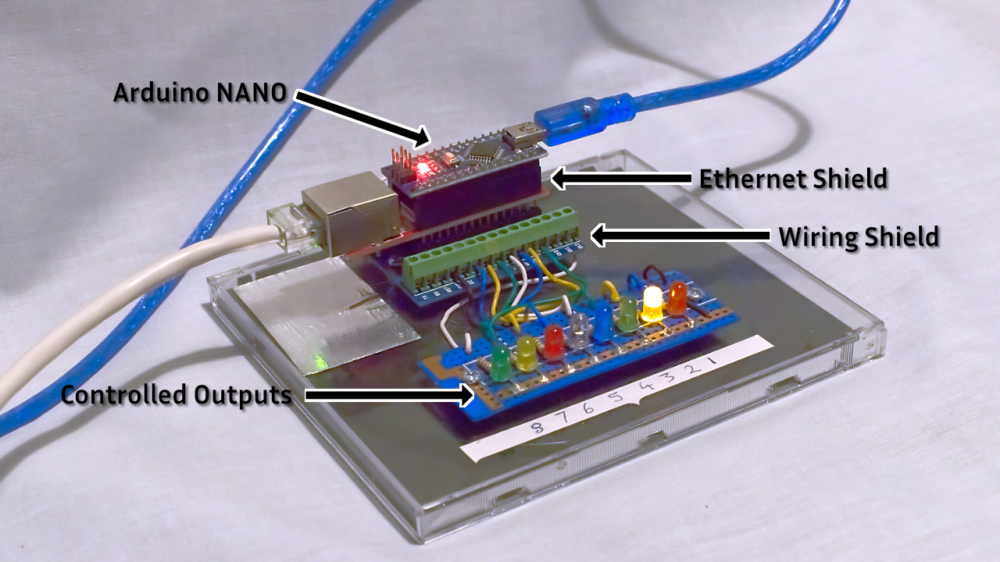
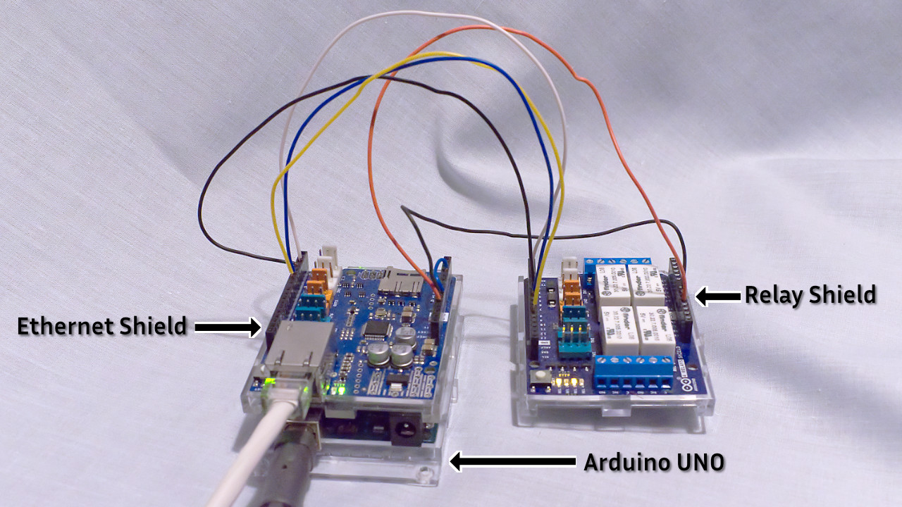

# Network General Purpose Output Interfaces
This project provides two methods that implement a simple eight-output GPO (General Purpose Output) interface. Two control message methods are supported to set the output state:  
1. **OSC (Open Sound Control) Messages**  
OSC uses UDP packets to deliver the messages, so there is no transport service guarantee of delivery, but this not an issue on small or medium sized network segments. The interface firmware includes user-controlled options to emit a UDP status message on request, and/or emit an output status message for each switch command received. These optional status messages can be used by a custom controller to check the interface is on line, and to establish the current output states.   

2. **HTTP GET messages**  
This application uses the http GET message to implement a very simple REST (**RE**presentational **S**tate **T**ransfer) control interface. GET messages use TCP/IP delivery, providing notification of delivery to the message sender. GET messages also require a response message from the http server. In this control instance the return message is a text string, configured as a stringified JSON object containing the state of every controlled output. The interface can be polled using a GET message containing no switching information.  

Each control method has it's own project sub-folder containing the descriptions and code detail for the method.  

The interface hardware comprises a low-cost microcontroller that either directly controls low-voltage LED indicators or controls off-the-shelf relay cards. The relay card provides galvanic isolation between the microcontroller and the controlled equipment.  

The microcontrollers used are Arduino units using the ATmega328P as the core processor. The code has been developed and tested on UNO R3 and the NANO R3. IP network connectivity uses off-the-shelf ethernet shields. The simple plug-together ethernet shields generally use WizNet chipset for the UNO platform and an ENC28J60 chip set for the NANO platform.  





The WizNet and ENC28J60 require different support libraries, as the WizNet implements more of the core API functions in the chip firmware, resulting in a smaller code footprint requirement in the Arduino program flash memory and RAM. This impacts on the HTTP GET control as the ENC28J60 library and the GPO interface firmware are too large to fit in the available flash memory and RAM.  

There are Wiznet interface boards that can be connected to pins on the Arduino microcontroller board, and these should permit the HTTP GET command to be run in the NANO hardware once the inter-module wiring harness is connected. This solution has not been tested by the author of this project.  

It is also possible to implement more controlled outputs using an Arduino MEGA microcontroller, but the operational code will need multiple changes to support the increased sizes of the look-up and status arrays.  

## Output Invert  
Relay cards differ in the input requirement that activates an output - some need a logic 0 to enable the output relay where others need a logic 1 to enable the output. The GPO interface includes an output-by-output invert control bit so the control system user thinks only open/closed or on/off and the GPO invert function sets the output level used to drive the relay.

The invert control state is held in non-volatile memory on the microcontroller card.

---
## Powering the Interface
The power requirements can differ depending on the current required to operate the relay board(s) when all outputs are active. Low operating power relays may be able to run from the 5V supply on the USB input to the interface. Higher powered relays of LED indicators need an external supply. This can be a 5V power source that connects to the relay board and the microcontroller, or a 12V supply to run 12V relays, using the on-board regulator to power the microcontroller from the 12V source.  

---
## MAC and IP Addressing
Each deployed interface requires a unique MAC address and IP address. Rather than burn the addresses into the program, the address information is entered using the serial link within the Arduino USB interface. The entered values are saved into EEPROM available in the microcontroller.

An interface that is installed and used on a single network only needs a single MAC address and IP address set (IP address, IP Mask, Gateway address, DNS server address). Some interfaces will be used as "bookable resources" and deployed to different network segments, hence needing different IP addresses. Rather than have to reprogram the interface on every network move, the GPO interface can store four sets of IP addresses (the MAC is common to all). This allows fast redeployment been commonly used networks. The address set in use is determined at reset by reading two input connections. Using simple links or switches on the input connections  supports rapid selection of the address set to use.  

---
## Controllers
There are multiple control solutions available for the GPO interface, two of which are available as open-source software.

### 1. Elgato StreamDeck with BitFocus Companion
Elgato make a versatile USB connected button array using LCD displays in each button enabling ICON button identification. BitFocus have developed software, available via GitHub, that works with the StreamDeck to control a wide selection of consumer and broadcast hardware.  

Two control protocols are OSC and HTTP GET, hence there is support for both GPO interface control methods. When the GET method is used with Companion version 3 software the returned status can be processed to extract the state of a switch, using that state to modify the display on one of the buttons.

### 2. CasparCG Standard Client
CasparCG is an open source graphics replay tool created by SVT, the Swedish Public Service Broadcaster. SVT  released a CasparCG client that controls the CasparCG server and other common broadcast kit. The client can issue OSC and GET messages, but does not display any status information returned by the GPO interface


### 3. Web Browser  
The GET control GPO interface can be controlled by a simple web page hosted on a web-server or as a local file. The underlying message transport mechanism uses the javascript fetch() function to issue the GET request and accepts the response.  

A web browser can also be used to check the connection to a GPO instance. Assume the GPO unit has an IP address of 192.168.42.190 and it listening on port 2001. The switch states can be set by address lines of the form:  

```
http://192.168.42.190:2001?s3=1  
http://192.168.42.190:2001?s1=0  
http://192.168.42.190:2001?s1=1&s2=0&s3=1  
```

The first example switches output 3 on, the second switches output 1 off, and the third switches output 1 on, output 2 off and output 3 on.

Windows 10 systems from version 1803, and macOS systems can use the command line `curl` tool to send a switch state.  
```
> curl "http://192.168.42.190:2001?s1=1&s2=0&s3=1"
```
It is important to put the quotes around the address or an error is reported by curl.

### 4. Custom Controller
Users can create their own custom controller solutions, such as using node.js to build a server that receives commands from a browser or Telnet source, converting the request into a OSC or GET as required. One advantage of a node.js server is it can act as a concentrator for multiple web based controllers. The server communicates with one or more interfaces, and offers websocket connection to browsers. When the output status changes the new state is reported to all connected clients.  

There are several examples that show how to use third party control system, for example Ross Video Dashboard, to send messages. Consult your favourite search engine.


